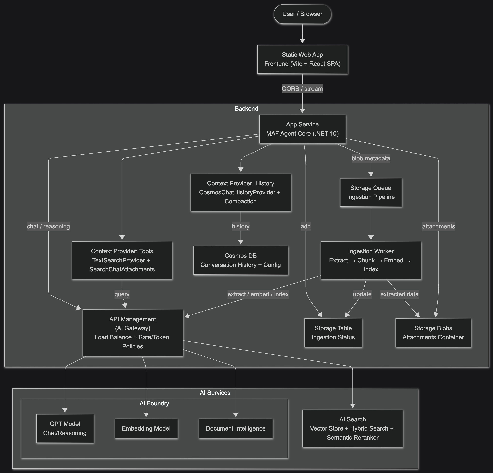
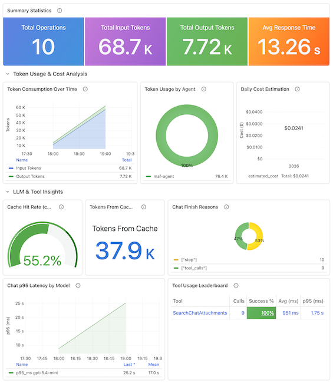

# Microsoft Agent Framework with AI Gateway, RAG, Content Safety and Document Intelligence

[](https://codespaces.new/ffilardi/maf-ai-agent) [](https://vscode.dev/redirect?url=vscode://ms-vscode-remote.remote-containers/cloneInVolume?url=https://github.com/ffilardi/maf-ai-agent)

This is a template for building **streaming AI agents** on the [Microsoft Agent Framework](https://learn.microsoft.com/agent-framework/) (.NET 10), grounded on your own data via RAG and fronted by an Azure API Management AI Gateway that load-balances and rate-limits access to Azure AI Foundry models.

Infra-as-Code (bicep) + Azure Dev CLI (azd) provision and deploy the whole solution with a single command.

## Features

- **Streaming chat** — token-by-token answers over the Vercel AI SDK UI Message Stream protocol, with live reasoning ("thinking") summaries and tool-call surfacing.
- **AI Gateway** — Azure API Management load-balances model deployments, enforces token/rate quotas, and authenticates to Azure OpenAI, Search, Document Intelligence, and Content Safety with **managed identity** (no keys in the app).
- **Content safety** — per-turn harm-category moderation plus Prompt Shields (jailbreak / prompt-injection detection), enforced at the gateway and in the backend.
- **RAG grounding** — hybrid (keyword + vector) retrieval with semantic re-ranking over Azure AI Search, exposed to the model as an on-demand `SearchChatAttachments` tool, with clickable source citations that preview the original file.
- **File attachments** — async ingestion pipeline (Document Intelligence extraction → chunking → embeddings → index) so users can upload documents and ground answers on them, scoped per conversation.
- **Server-side history** — conversations persist in Cosmos DB keyed by session, with in-context compaction to bound token cost per turn.
- **Tunable per session** — model picker, reasoning-effort control, custom system prompt, and a "answer only from attachments" RAG-only toggle in the UI.
- **Built-in FinOps** — monthly budget alerts, a token & cost showback workbook, ingestion caps, and right-sizing levers ship on by default (see [FinOps](./doc/finops.md)).

## Prerequisites

- **[Azure Developer CLI (`azd`)](https://learn.microsoft.com/azure/developer/azure-developer-cli/install-azd)** — the only tool required to provision and deploy.
- **An Azure subscription** with permission to create resource groups and role assignments.
- **Model quota** in your target region for the two deployments below (both `GlobalStandard`). Check availability under *Azure AI Foundry → Quotas* before deploying.

> Local development additionally needs the [.NET 10 SDK](https://dotnet.microsoft.com/download/dotnet/10.0) (backend) and [Node 20+](https://nodejs.org/) (frontend) — see the [Quickstart](./doc/quickstart.md).

## Quickstart

```shell
azd auth login
azd up
```

`azd up` provisions all Azure resources and deploys both apps. It prompts for an environment name, region, and subscription, then prints the frontend URL when done. Tear everything down with `azd down --purge`.

For local development, extending the agent, and cleanup, see the **[Quickstart guide](./doc/quickstart.md)**.

## Architecture

The solution is two tiers and one gateway. A Vite + React SPA on Azure Static Web Apps calls the .NET 10 App Service backend directly from the browser over CORS, streaming each turn token-by-token — there is no proxy tier in between.

The backend owns the Microsoft Agent Framework agent and everything stateful: conversation history in Cosmos DB, uploaded files in Blob Storage, and a background worker that drains a Storage Queue to ingest those files into Azure AI Search for retrieval.

Every call to an AI service — chat, embeddings, retrieval, Document Intelligence, Content Safety — is routed through API Management acting as an **AI Gateway**. APIM load-balances across model deployments, enforces token and rate quotas, and authenticates to each backing service with its managed identity, so the only credential the application carries is its APIM subscription key.

The whole estate is split across four resource groups per environment (monitoring, common, app, AI) and provisioned by Bicep through `azd`.

<div align="center">
  <figure>
    <br />
    <figcaption><i>Architecture Diagram</i></figcaption>
  </figure>
</div><br />

## Models

The agent deploys two Azure AI Foundry model deployments. Quota is the per-model TPM (tokens-per-minute) ceiling, set as GlobalStandard capacity — a rate limit, not a fixed charge (GlobalStandard bills pay-per-token).

| Model | Deployment SKU | Quota (default) |
| ----- | -------------- | --------------- |
| `gpt-5.4-mini` (chat) | GlobalStandard | 1,000K TPM |
| `text-embedding-3-large` (embeddings) | GlobalStandard | 150K TPM |

Swap models, versions, or capacity in [`infra/modules/foundry/foundry.bicep`](infra/modules/foundry/foundry.bicep). The list of chat models the SPA offers (and the default) is threaded through `chatModelDeployments` in [`infra/main.bicep`](infra/main.bicep).

### AI Gateway (API Management)

API Management service acts as an AI gateway and intelligent load balancer for Azure OpenAI model deployments:

- **Round-Robin Distribution:** Requests are distributed across multiple model deployment instances
- **Retry Logic:** Automatic retry on transient failures (429, 503 errors)
- **Backend Selection:** Policy-based routing to available model endpoints
- **Monitoring:** Full telemetry through Application Insights

#### API Management Configuration

| Component | Description |
| --------- | ----------- |
| [APIM Load Balancing](doc/load-balancing.md) | Load balancing types, configuration options, and traffic distribution strategies for Azure OpenAI model deployments |
| [APIM Load Balancing Examples](doc/load-balancing-examples.md) | Bicep configuration examples for round-robin, weighted, and priority-based load balancing scenarios |
| [APIM Policies](doc/apim-policies.md) | APIM policy definitions for managed identity authentication, rate limiting, token quotas, and security controls |
| [APIM Application Insights](doc/apim-app-insights.md) | Application Insights integration setup for API-level logging, sampling, and monitoring configuration |
| [APIM Azure Monitor](doc/apim-azure-monitor.md) | Service-level diagnostic settings to Log Analytics, the `enableVerboseLogs` switch, and gateway token metrics |

### Retrieval-Augmented Generation (RAG)

The agent grounds its answers on your own content using [Azure AI Search](https://learn.microsoft.com/azure/search/) and the Microsoft Agent Framework's `TextSearchProvider`, exposed to the model as an on-demand search tool. When the tool is used, its name is returned in the response and displayed in the user interface.

For a complete guide to the RAG wiring, index schema, and implementing the retrieval query, check the [RAG Guide](doc/rag.md).

## Observability

Every chat turn, tool call, and retrieval flows into **Application Insights** via OpenTelemetry using the GenAI/Agent Framework semantic conventions, so it's picked up automatically by the built-in Agent Framework dashboard. No manual dashboard wiring required.

<div align="center">
  <figure>
    <br />
    <figcaption><i>Application Insights → Monitoring → Dashboards with Grafana</i></figcaption>
  </figure>
</div><br />

The project also ships two purpose-built Azure Monitor workbooks:

- **Agent Operations** (request health, dependency latency, the RAG retrieval audit trail, Content Safety detections)
- **Token & Cost Insights** (see [FinOps](./doc/finops.md)) — for signal this stock dashboard doesn't surface. Full telemetry wiring, log call sites, and KQL query examples are in the [Logging guide](./doc/logging.md).

## Costs

The table below estimates the **fixed monthly cost** of the default SKUs/tiers (excluding model token consumption, which is usage-based). Prices vary by region — validate with the [Azure pricing calculator](https://azure.microsoft.com/pricing/calculator/).

| Resource type | Tier / SKU | Est. monthly cost (USD) |
| ------------- | ---------- | ----------------------- |
| Azure API Management | Developer | ~$50 |
| Azure App Service (backend) | Basic B1 (Linux) | ~$13 |
| Azure Static Web Apps (frontend) | Free | $0 |
| Azure Cosmos DB | Provisioned + Free tier | $0¹ |
| Azure AI Search | Free | $0² |
| Azure AI Foundry / OpenAI | GlobalStandard (pay-per-token) | Usage-based |
| Application Insights + Log Analytics | Pay-as-you-go (1 GB/day cap) | ~$0–5 |
| Azure Key Vault | Standard (per-transaction) | <$1 |
| Storage Account | Standard LRS | ~$1–2 |
| **Fixed floor (demo defaults)** | | **~$65/mo + model tokens** |

¹ Cosmos free tier (1,000 RU/s + 25 GB) is one per subscription; without it, provisioned throughput is ~$24/mo.
² Azure AI Search Free tier is one per subscription (50 MB storage, no SLA); bump to `basic` for production scale.

Cost visibility, budget alerts, and every right-sizing lever are documented in **[FinOps](./doc/finops.md)**.

## Documentation

- **[Features](./doc/features.md)** — detailed overview of backend, frontend, infrastructure, and security features
- **[Getting Started](./doc/getting-started.md)** — GitHub Codespaces, VS Code Dev Containers, and local environment setup
- **[Quickstart](./doc/quickstart.md)** — provisioning, local development, extending the solution, and cleanup
- **[Guidance](./doc/guidance.md)** — region availability, quotas, dependencies, configuration, monitoring, security, and performance
- **[FinOps](./doc/finops.md)** — cost visibility, spend guardrails, and right-sizing levers built into the infrastructure
- **[RAG Guide](./doc/rag.md)** — Azure AI Search RAG wiring, index schema, and retrieval query
- **[Logging](./doc/logging.md)** — backend telemetry, streaming/persist error handling, and the RAG retrieval audit trail
